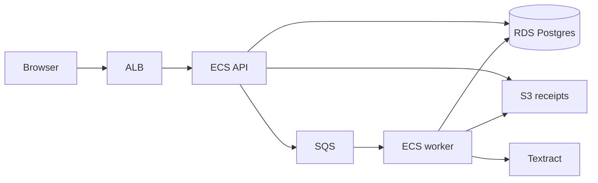

# Resitku

Personal expense tracker with receipt OCR. Snap a photo, confirm the parsed amount and date, and it becomes a transaction. UI copy is Malay; code and this README are English.

Built as a small, interview-defendable AWS portfolio: one Docker image, an Application Load Balancer, ECS Fargate (API + worker), private RDS Postgres, S3, SQS, and Textract.

## What it does

- Register / log in (access JWT in memory, refresh token in an HttpOnly cookie)
- Upload a receipt image (JPEG, PNG, or WebP, max 5 MB)
- Background worker reads vendor, amount, and date
- Confirm the parse into a categorised transaction, or enter one by hand
- Dashboard: net / income / expense for the current month

## Architecture



Locally, Docker Compose stands in for RDS / S3 / SQS (Postgres, MinIO, ElasticMQ). OCR uses a **stub** so you do not need AWS credentials. In AWS, `OCR_PROVIDER=textract`.

## Stack

| Layer | Choice |
| --- | --- |
| Web | Vite, React 19, Tailwind v4 |
| API | Node 22, Express 5, Prisma 7, Zod |
| Shared | `@resitku/shared` — money helpers and request schemas |
| Local deps | Docker Compose: Postgres 17, MinIO, ElasticMQ |
| AWS | ECS Fargate, ALB, RDS, S3, SQS, Textract, Secrets Manager, CloudWatch |

Money is stored as integer **sen** (`amountMinor`), never a float.

## Repository

```
apps/api          Express API + OCR worker
apps/web          React UI
packages/shared   Zod schemas and money formatting
infra             Terraform (VPC, ALB, ECS, RDS, S3, SQS, IAM)
Dockerfile        One image: API by default, worker via `node dist/worker.js`
```

## Local development

Needs **Node 20.19+** (22 matches production) and **Docker**.

```bash
cp .env.example .env
# Set JWT_ACCESS_SECRET to at least 32 characters:
#   openssl rand -base64 48

npm ci
npm run db:up
npm run storage:up
npm run db:migrate
npm run db:seed          # optional: demo@resitku.test / demo-password-123

npm run dev              # API → http://localhost:3000
npm run worker:dev -w @resitku/api
npm run dev -w @resitku/web   # UI → http://localhost:5173
```

Leave `VITE_API_URL` empty. Vite proxies `/api` to `http://localhost:3000` so the browser stays same-origin (cookies + Helmet — see below).

Probes: `GET /healthz` (process up) and `GET /readyz` (database reachable).

```bash
npm test
npm run typecheck
npm run lint
```

## Auth and the Vite proxy

Login returns a short-lived access token (Bearer) and sets `resitku_refresh` as an HttpOnly cookie (`SameSite=Lax`, path `/api/auth`). Refresh and logout send that cookie with `credentials: "include"`.

Helmet defaults include `Cross-Origin-Resource-Policy: same-origin`. Pointing the browser **directly** at another origin (for example the ALB hostname) will drop cookies and can block responses.

The Vite proxy exists so local UI and API look like one origin. Production needs the UI and API on the **same site** (or HTTPS + matching `CORS_ORIGIN` and a `Secure` cookie). Do not commit an ALB hostname in `apps/web/vite.config.ts`.

## HTTP API

All JSON routes sit under `/api`. Authenticated routes expect `Authorization: Bearer <accessToken>`.

| Method | Path | Notes |
| --- | --- | --- |
| POST | `/api/auth/register` | Sets refresh cookie |
| POST | `/api/auth/login` | Sets refresh cookie |
| POST | `/api/auth/refresh` | Cookie in, new access token out |
| POST | `/api/auth/logout` | Clears cookie |
| GET | `/api/auth/me` | Current user |
| GET/POST | `/api/categories` | Per-user; starter set on register |
| PATCH/DELETE | `/api/categories/:id` | |
| GET/POST | `/api/transactions` | Amounts as decimal strings in JSON, sen in the DB |
| GET | `/api/transactions/summary` | Current calendar month |
| GET/PATCH/DELETE | `/api/transactions/:id` | Soft delete |
| POST | `/api/receipts` | `multipart/form-data` field `file` |
| GET | `/api/receipts` | |
| POST | `/api/receipts/:id/confirm` | Creates the transaction |

## AWS (Terraform)

`infra/` creates:

- VPC with two public subnets (no NAT gateway — keeps the credit bill down)
- ALB on port 80, forwarding to the API, health check `/healthz`
- ECS Fargate services: **api** (`node dist/server.js`) and **worker** (`node dist/worker.js`)
- RDS Postgres 17, not publicly accessible; SG allows 5432 only from ECS
- S3 bucket for receipt objects
- SQS queue for OCR jobs
- Secrets Manager for `DATABASE_URL` and `JWT_ACCESS_SECRET`
- IAM task role for S3, SQS, and Textract

`enable_ecs_services` starts `false` so you can apply the network and ECR repo, push an image, then turn services on.

```bash
cd infra
cp terraform.tfvars.example terraform.tfvars
# edit tfvars — never commit this file

terraform init
terraform apply
```

Build for Fargate (amd64) and push to the `ecr_repository_url` output. Then set `enable_ecs_services = true` and apply again. Run Prisma migrations against RDS from a one-off task using the same image:

```text
npx prisma migrate deploy
```

RDS requires TLS. If the Node driver rejects the Amazon CA chain, `DATABASE_URL` may need `sslmode=no-verify` (documented trade-off: encryption in transit, without full CA verification).

ALB DNS is an output (`alb_dns_name`). There is no custom domain or HTTPS listener yet; a hosted frontend on another origin will not keep the refresh cookie until that is in place.

### Do not commit

- `.env`, `infra/terraform.tfvars`, `*.tfstate`
- Live ALB / account-specific hostnames in Vite config

## Design choices worth defending

- **One image, two processes** — API and worker share the build; ECS overrides the worker command.
- **Stub OCR locally** — same queue and S3 flow, no Textract bill while developing.
- **Hashed, rotated refresh tokens** — the DB stores a hash; reuse of a stolen cookie revokes the family.
- **Health vs ready** — `/healthz` never touches Postgres, so a short RDS blip does not make the ALB kill healthy tasks. `/readyz` does, and returns 503 during shutdown so the ALB can drain.
- **`trust proxy` = 1** — only the ALB hop is trusted, so clients cannot spoof `X-Forwarded-For` past the rate limiter.
